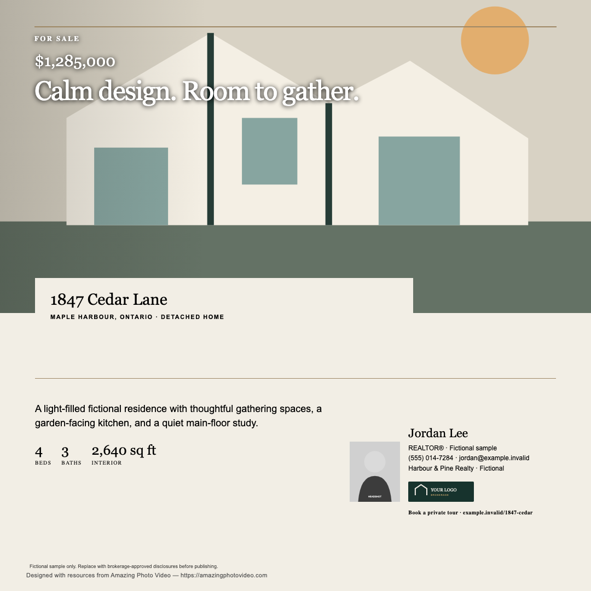
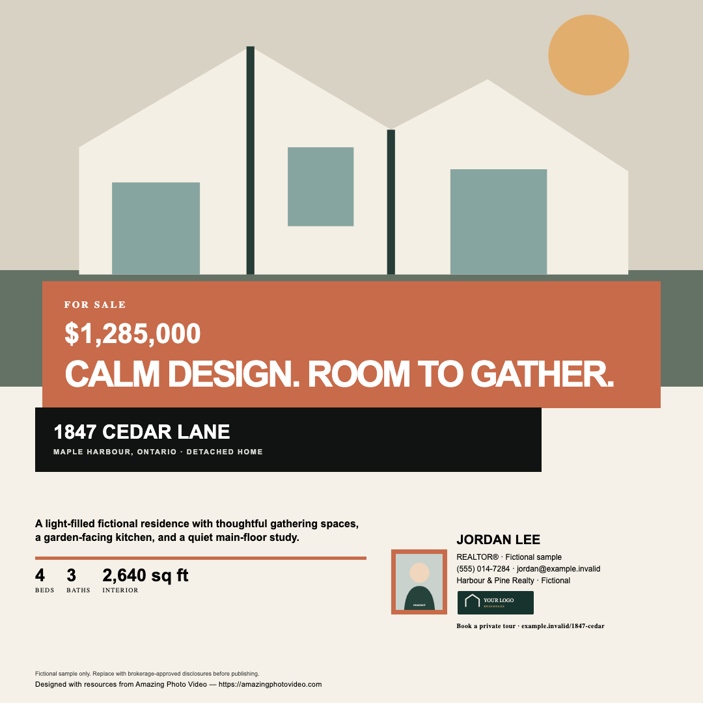
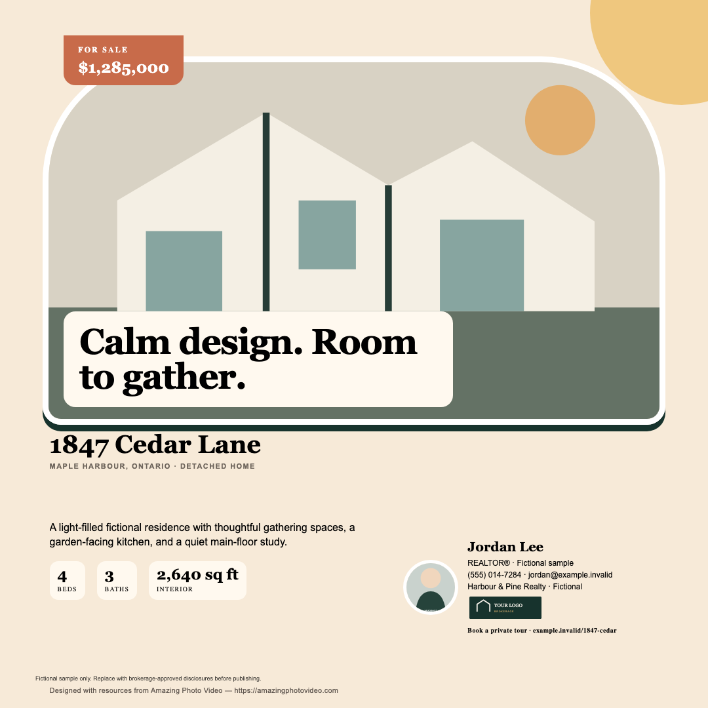
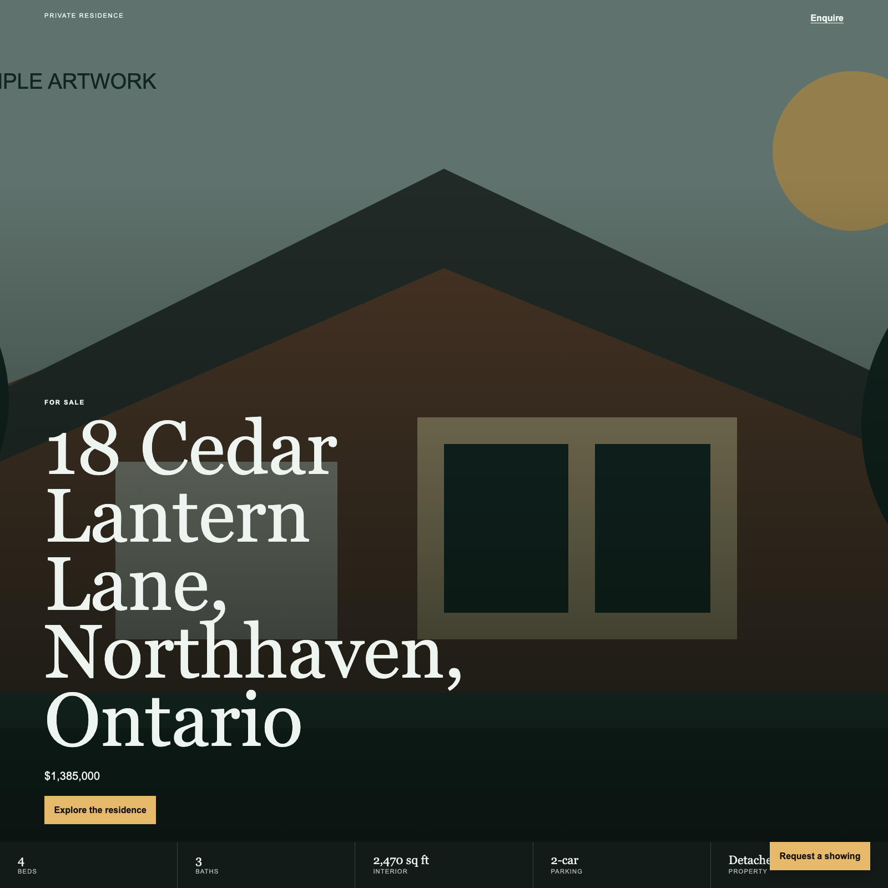
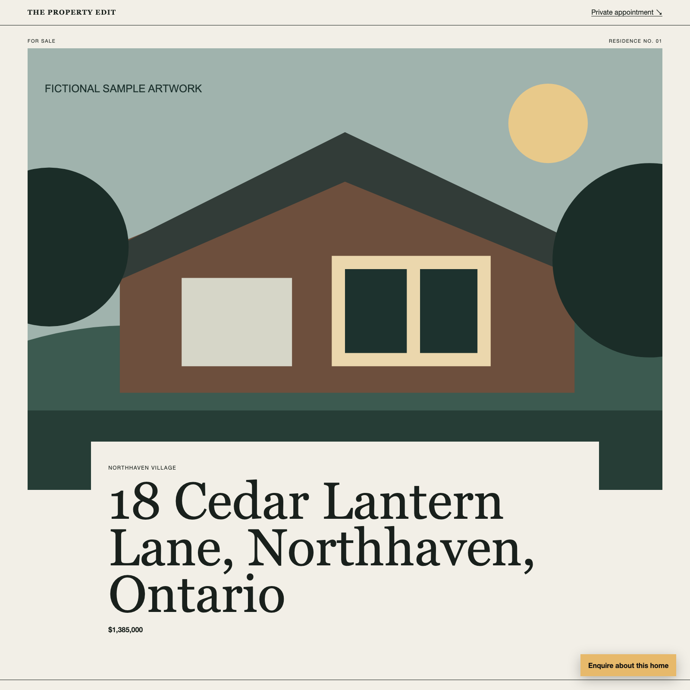
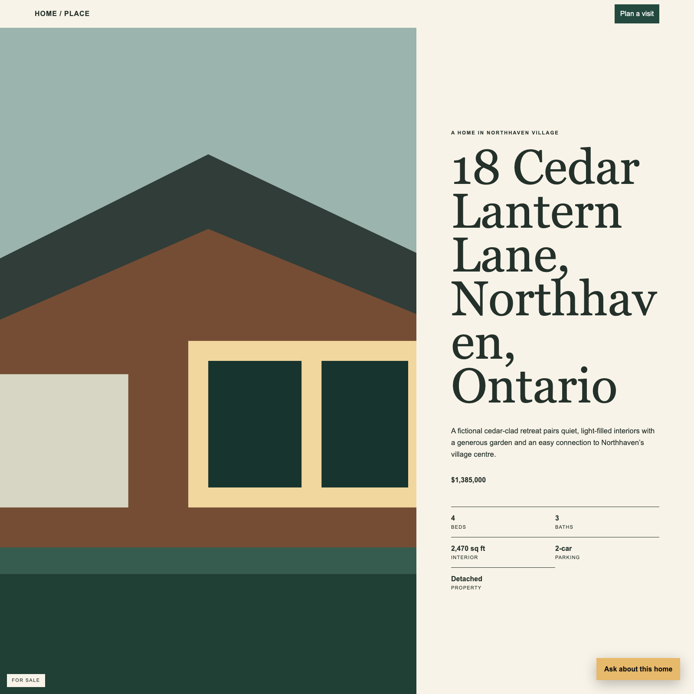
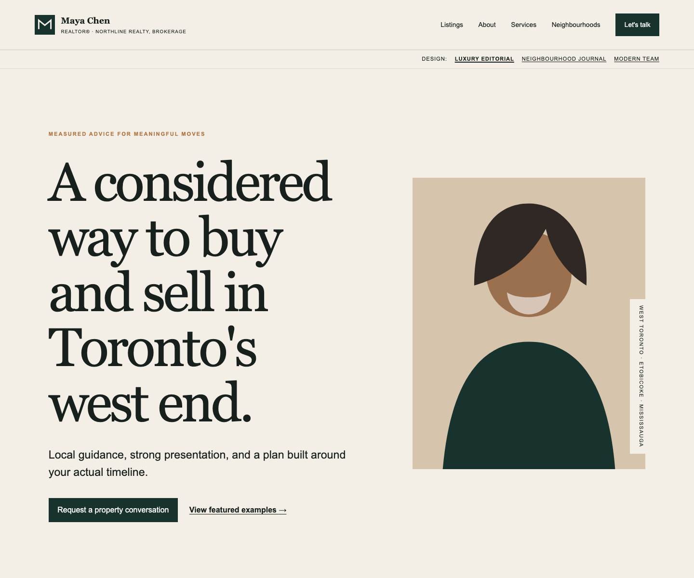
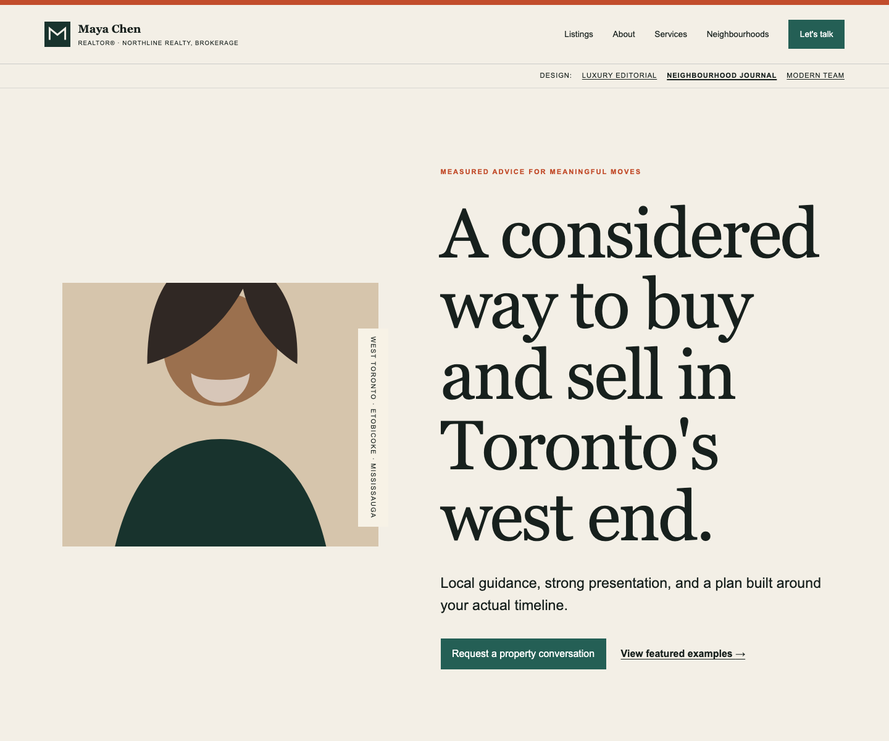
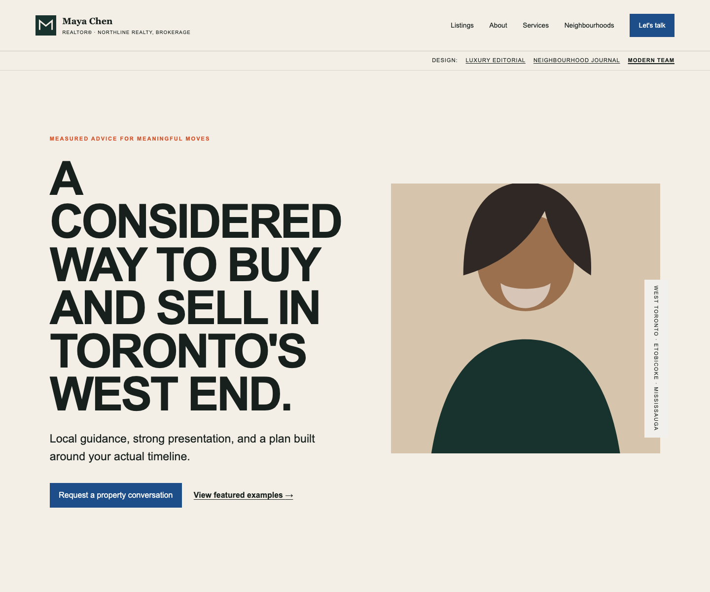

# Creative toolkit gallery

Preview the fictional sample outputs before opening the builders. Every address, agent, brokerage, image, price, and contact detail shown here is fictional and must be replaced with verified, approved material before publication.

> **Usage:** These creative assets use the [APV design asset licensing policy](./docs/design-asset-licensing.md), which is separate from the publicly accessible prompt and tutorial library. The credits identify Amazing Photo Video as the toolkit provider—not as the photographer, listing brokerage, or producer of any sample property media.

## Flyer and social design packs

Each family can generate coordinated print, feed, portrait, story, and landscape formats from the same verified listing and branding data. [Open the design-pack builder guide](./design-packs/README.md).

### Editorial luxury

### Bold modern

### Warm neighbourhood

## Single-property page designs

These dependency-light static sites use approved listing facts and media. They are not MLS®, VOW, DDF®, or IDX feeds. [Open the property-page builder guide](./property-pages/README.md).

### Cinematic

### Editorial

### Neighbourhood

## Realtor website presets

The agent-site starter includes manual listing examples and an optional CRM starter. It does not include a live board feed or deploy itself. [Open the Realtor site and CRM starter guide](./agent-sites/README.md).

### Luxury editorial

### Neighbourhood journal

### Modern team

---

Creative toolkit maintained by [Amazing Photo Video](https://amazingphotovideo.com). Use only media, branding, testimonials, property facts, and disclosures you are authorized to publish.
